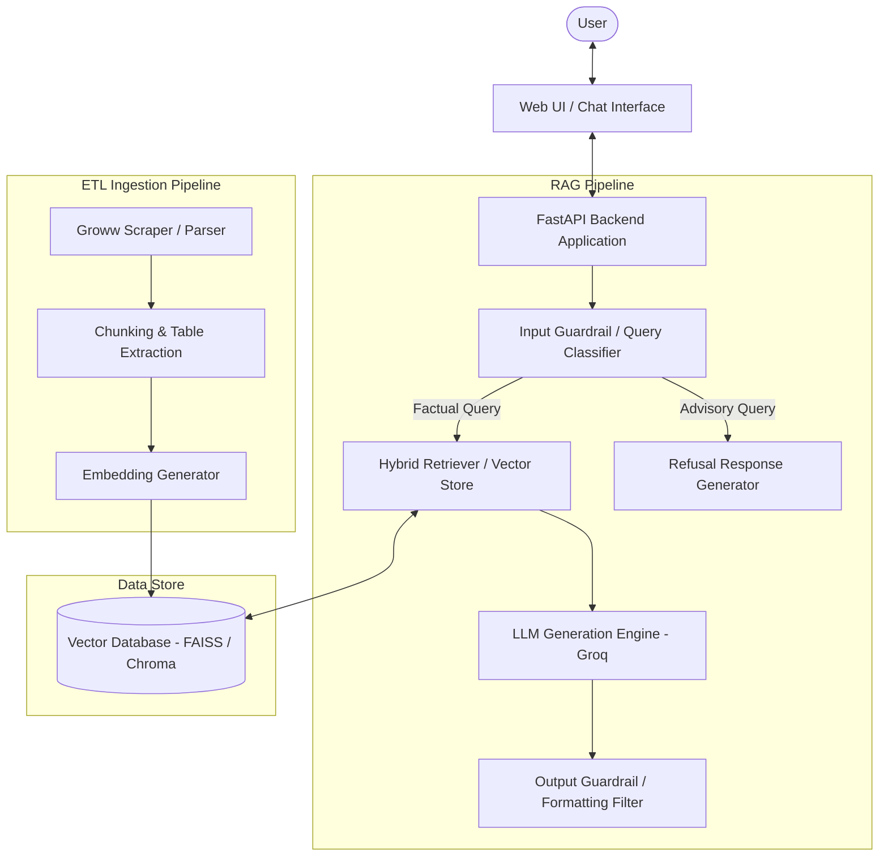
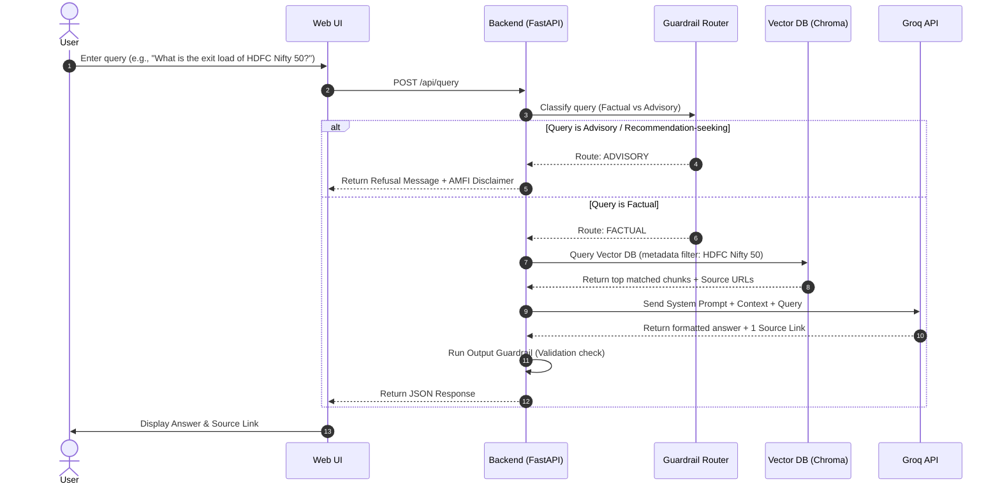

# System Architecture: Mutual Fund FAQ Assistant (RAG Bot)

This document describes the high-level design and detailed component architecture of the Retrieval-Augmented Generation (RAG) based Mutual Fund FAQ Assistant. The system is designed to provide facts-only answers to user queries regarding specific mutual funds, leveraging the 5 specific Groww mutual fund URLs as the sole factual source.

---

## 1. System Overview

The Mutual Fund FAQ Assistant uses a **Retrieval-Augmented Generation (RAG)** pipeline to answer user questions using verified official sources. To maintain compliance and trust, the architecture incorporates strict input/output guardrails to filter out investment advice, opinions, and predictions.

---

## 2. Component Architecture

### A. Data Ingestion (ETL) Pipeline
Since mutual fund data (expense ratios, exit loads, asset sizes) is highly structured and often resides in tables, the ingestion pipeline must accurately capture both text and tabular structures.

1. **Scraper & Parser**:
   * Extracts and parses clean HTML from the 5 specific Groww mutual fund URLs. No external PDFs or other external website sources are parsed.
2. **Chunking & Processing**:
   * **Table Extraction**: Employs table-aware parsers (e.g., `pdfplumber` or markdown converter) to ensure tables don't lose row/column relationships during chunking.
   * **Semantic/Markdown Chunking**: Groups text by sub-headings (e.g., "Exit Load", "Minimum SIP") rather than arbitrary character counts to preserve local context.
3. **Embedding & Vector Storage**:
   * Generates dense vectors using a BGE embedding model (e.g., `BAAI/bge-small-en-v1.5` via sentence-transformers).
   * Stores vector embeddings and raw chunk text in a local vector database (e.g., **ChromaDB** or **FAISS**), storing metadata such as `source_url`, `fund_name`, and `last_updated_date`.

### B. Input Guardrail (Query Classifier)
To prevent the LLM from hallucinating advice, the system intercepts all user queries before sending them to the retriever.

* **Purpose**: Identifies whether the query is **Factual** (e.g., "What is the exit load?") or **Advisory/Opinion-based** (e.g., "Should I buy this fund?").
* **Mechanism**: A lightweight classification step (using zero-shot classification, fine-tuned router, or a structured prompt with LLM) to categorize the query.
* **Routing**:
  * **Advisory/Unsupported**: Bypasses RAG retrieval and instantly returns the predefined standard refusal message.
  * **Factual**: Proceeds to the retrieval step.

### C. Retrieval Pipeline
Factual queries require high-precision retrieval to pull numbers (ratios, dates, percentages) accurately.

* **Hybrid Search**: Combines **Dense Retrieval** (semantic similarity) and **Sparse Retrieval** (BM25 keyword matching) to locate exact terms like specific numbers, acronyms, or fund names.
* **Context Filtering**: Filters the vector space strictly by the relevant mutual fund mentioned in the query (metadata filtering by `fund_name`).
* **Reranking**: Scores the retrieved chunks (using a cross-encoder model) to ensure the most relevant factual context is at the top.

### D. LLM Generation Engine
* **Model**: Groq API (e.g., Llama 3 or Mixtral models).
* **System Prompting**:
  * Restricts response strictly to the provided context.
  * Prohibits assumptions, opinions, or extrapolations.
  * Enforces the 3-sentence limit.
  * Enforces formatting rules (exactly one source link, plus a "Last updated" date).

### E. Output Guardrail (Validation Layer)
Before the response is delivered to the frontend, a validation layer evaluates the LLM output:

* **Link Verification**: Confirms that the output contains exactly one valid citation URL present in the retrieved context.
* **Refusal Scan**: Ensures no advisory trigger words (e.g., "recommend", "buy", "good choice", "outperform") are accidentally generated.
* **Length Validation**: Confirms the response is at most 3 sentences.

---

## 3. Data Flow Diagram (Sequence)

This diagram outlines the sequential flow of a user query from the UI to the backend and RAG engine.

---

## 4. Tech Stack Recommendations

To keep the prototype lightweight, highly functional, and easy to build, the following stack is recommended:

| Layer | Technology | Rationale |
|---|---|---|
| **Frontend UI** | HTML / CSS (Vanilla) / JS | Lightweight, clean, zero complex build step requirements for simple prototype. |
| **Backend API** | Python (FastAPI) | High performance, native support for async processes, built-in docs, easy integration with Python ML tools. |
| **Orchestration**| LangChain or LlamaIndex | Standard framework for RAG indexing, chunking, prompts, and tool chain setup. |
| **Vector DB** | ChromaDB (Local / In-Memory) | Embedded, zero-install database ideal for prototyping. |
| **Embeddings** | BGE Embedding (e.g., `BAAI/bge-small-en-v1.5`) | Local high-performance open-source embedding model via sentence-transformers. |
| **LLM** | Groq (Llama 3 / Mixtral) | High performance, ultra-fast inference speed. |

---

## 5. Security and Compliance Safeguards

1. **No PII Collection**: The database only stores parsed Groww fund details and stats. User queries are not logged alongside user identity info. No inputs like PAN card numbers, email IDs, or names are accepted.
2. **Disclaimer Prominence**: Every response includes a standard footer disclaimer: *Disclaimer: Facts-only. No investment advice.*
3. **Hardcoded Refusals**: Pre-configured response templates for advice requests ensure that the LLM is not in the loop for generating refusal replies, guaranteeing 100% compliance. All refusals include a direct link to Groww's official investor education resources (`https://groww.in/blog/mutual-funds-for-beginners-investor-education`).
4. **General Platform FAQ Support**: The RAG corpus is supplemented with static platform assistance chunks to support queries like "How to download capital-gains statement?", returning the precise guide steps and citing the official help URL: `https://groww.in/help/mutual-funds/reports-and-statements/how-to-download-capital-gains-statement`.

