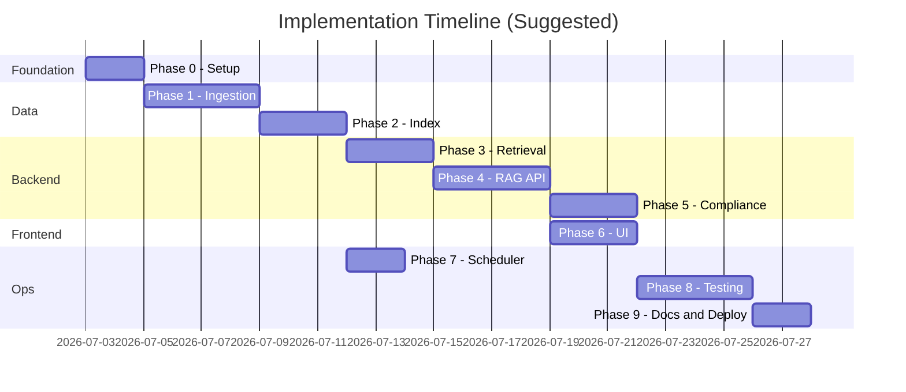

# Implementation Plan: Mutual Fund FAQ Assistant

This document defines a **phase-wise implementation plan** for the facts-only RAG assistant described in [problemStatement.md](file:///d:/anita/product-AI-training/RAG_Project/mutual-fund-faq-bot/docs/problemStatement.md) and [architecture.md](file:///d:/anita/product-AI-training/RAG_Project/mutual-fund-faq-bot/docs/architecture.md).

---

## Overview

| Item | Detail |
|------|--------|
| **Product** | Facts-only FAQ assistant for selected multi-AMC mutual fund schemes (Groww reference context) |
| **AMCs** | Nippon India, ICICI Prudential, HDFC, Groww |
| **Corpus** | 5 Groww scheme URLs |
| **Approach** | Lightweight RAG with local BGE embeddings, query classification, Groq LLM, source-backed answers, and daily ingestion |
| **Primary deliverable** | Working chat assistant + README + automated daily corpus refresh |

### Phase Summary

| Phase | Focus | Outcome |
|-------|--------|---------|
| [Phase 0](#phase-0--project-foundation) | Project foundation | Repo scaffold, config, dependencies |
| [Phase 1](#phase-1--corpus--ingestion-pipeline) | Corpus & Ingestion | Parsed, chunked data from 5 URLs |
| [Phase 2](#phase-2--embedding--vector-index) | Embedding & Index | Searchable vector store + metadata index |
| [Phase 3](#phase-3--retrieval-layer) | Retrieval Layer | Scheme-aware chunk retrieval |
| [Phase 4](#phase-4--rag-backend--api) | RAG Backend & API | Grounded answers via `POST /api/chat` using Groq |
| [Phase 5](#phase-5--compliance-layer) | Compliance Layer | Classifier, refusals, validator, formatter |
| [Phase 6](#phase-6--ui) | UI | Minimal chat interface with disclaimer |
| [Phase 7](#phase-7--daily-scheduler) | Daily Scheduler | Automated once-daily ingestion |
| [Phase 8](#phase-8--testing--quality-assurance) | Testing & QA | Automated tests + manual query matrix |
| [Phase 9](#phase-9--documentation--deployment) | Docs & Deployment | README, runbooks, local setup |



> **Note:** Phases 6 and 7 can run in parallel once Phase 4 is stable. Phase 7 only requires Phase 2 (index exists); it does not block the chat API.

---

## Phase 0 — Project Foundation

**Goal:** Establish project structure, configuration, and development environment.

### Tasks
- [ ] Create directory layout matching standard structure:
  ```
  mutual-fund-faq-bot/
  ├── config/
  │   └── corpus.yaml
  ├── data/
  │   ├── raw/
  │   ├── processed/
  │   └── index/
  ├── docs/
  ├── src/
  │   ├── ingestion/
  │   └── api/
  ├── tests/
  ├── requirements.txt
  └── .env
  ```
- [ ] Initialize Python environment and list core dependencies in `requirements.txt`:
  * `groq` (SDK for fast Llama/Mixtral inference)
  * `sentence-transformers` (for local BGE embedding execution)
  * `beautifulsoup4`, `requests` (for web scraping)
  * `chromadb` (vector database)
  * `fastapi`, `uvicorn` (backend server)
  * `python-dotenv` (for loading variables)
- [ ] Create `config/corpus.yaml` with the 5 scheme URLs, slugs, categories, and aliases.
- [ ] Add `.env.example` for API keys (`GROQ_API_KEY`, local embedding provider).
- [ ] Create `.gitignore` (exclude `.env`, `data/`, `__pycache__`).

### Deliverables
| Artifact | Location |
|----------|----------|
| Corpus config | `config/corpus.yaml` |
| Environment template | `.env.example` |
| Dependency manifest | `requirements.txt` |

### Exit Criteria
* Project installs cleanly in a fresh virtual environment.
* `corpus.yaml` lists all 5 schemes with correct Groww URLs.
* FastAPI app starts with a health endpoint (`GET /health`).

---

## Phase 1 — Corpus & Ingestion Pipeline

**Goal:** Fetch and parse the five Groww scheme pages into structured, section-tagged content.

### Tasks
- [ ] **`src/ingestion/fetch.py`** — Fetch each corpus URL; save raw HTML/markdown to `data/raw/` with a fetch timestamp.
- [ ] **`src/ingestion/parse.py`** — Strip navigation, footers, and duplicate chrome; extract scheme-specific content.
- [ ] **Section extraction** — Tag content into sections:
  * `overview`, `expense_ratio`, `exit_load`, `minimum_investment`, `benchmark`, `fund_management`, `investment_objective`.
- [ ] **`src/ingestion/chunk.py`** — Section-aware chunking (see Chunking strategy below).
- [ ] **`src/ingestion/run.py`** — CLI entrypoint: `python -m src.ingestion.run` runs fetch → parse → chunk and writes to `data/processed/`.

### Chunking Strategy
| Rule | Detail |
|------|--------|
| **Source** | `data/processed/{slug}/sections.json` only |
| **Default** | One chunk per section (7 sections × 5 schemes) |
| **`fund_management`** | Split **one chunk per fund manager**; keep each manager's bio intact |
| **Overlap** | None between sections (sections are already small) |
| **Max size** | ~400 tokens (~1600 chars); split on paragraph boundaries only if exceeded |
| **Chunk text prefix** | `Scheme:`, `Section:`, `Source:` header for embedding context |
| **Chunk ID** | `{slug}#{section}#{index}` (e.g. `hdfc-nifty-50-index-fund-direct-growth#exit_load#0`) |

### Corpus URLs (Reference)
1. **Nippon India Large Cap Fund Direct Growth**: `https://groww.in/mutual-funds/nippon-india-large-cap-fund-direct-growth`
2. **ICICI Prudential Nifty Next 50 Index Fund Direct Growth**: `https://groww.in/mutual-funds/icici-prudential-nifty-next-50-index-fund-direct-growth`
3. **HDFC Nifty 50 Index Fund Direct Growth**: `https://groww.in/mutual-funds/hdfc-nifty-50-index-fund-direct-growth`
4. **Groww Nifty Total Market Index Fund Direct Growth**: `https://groww.in/mutual-funds/groww-nifty-total-market-index-fund-direct-growth`
5. **ICICI Prudential Nifty Index Fund Direct Growth**: `https://groww.in/mutual-funds/icici-prudential-nifty-index-fund-direct-growth`

### Exit Criteria
* All 5 URLs fetch successfully without manual intervention.
* Each scheme has chunks for `expense_ratio`, `exit_load`, `minimum_investment`, `benchmark`, and `fund_management`.
* `python -m src.ingestion.run` completes fetch → parse → chunk with validation passing.

---

## Phase 2 — Embedding & Vector Index

**Goal:** Embed chunks and persist a searchable vector store plus scheme metadata index.

### Embedding Model Choice
Use a **free local BGE model** (`BAAI/bge-small-en-v1.5`) via `sentence-transformers`. Prepend query prefix: `"Represent this sentence for searching relevant passages: "` to user queries at search time.

### Vector Store Choice
Use **ChromaDB** (local, persistent).
```
data/index/
├── active.json          # pointer to active Chroma collection
└── chroma/              # Chroma persistent storage
```

### Tasks
- [ ] **`src/ingestion/index.py`** — Load chunks from `data/processed/`, generate BGE embeddings, upsert into Chroma.
- [ ] Configure local embedding model (`BAAI/bge-small-en-v1.5` via sentence-transformers + Chroma).
- [ ] Build **scheme metadata index** (`data/processed/metadata.json`) with slug, name, category, `source_url`, `last_fetched_at`.
- [ ] Implement index swap strategy: new collection → update `active.json` → delete old collection.

### Exit Criteria
* Index contains chunks across all 5 schemes.
* Semantic search returns relevant chunks for sample queries ("expense ratio index fund", "fund manager").
* `python -m src.ingestion.run --index-only` builds Chroma index and validates successfully.

---

## Phase 3 — Retrieval Layer

**Goal:** Implement scheme-aware retrieval over the indexed corpus with high precision.

### Tasks
- [x] **`src/api/retriever.py`** — Write a retrieval client that queries ChromaDB.
- [x] Implement metadata filtering by `scheme_slug` extracted from the query.
- [x] Implement query preprocessing (e.g., query cleanup, embedding prefix formatting).
- [x] Combine dense retrieval with sparse keyword searches (Hybrid Retrieval) to ensure matching for exact percentage rates or lock-in periods.

### Implemented Retrieval Strategy
* **Pre-Routing Scheme Extraction**: Fuzzy scans user input queries for aliases mapping to the 5 targeted slugs (configured in `corpus.yaml`). If matched, it enforces a strict ChromaDB metadata filter on `scheme_slug` to prevent context leakage across funds.
* **Embedding Query Prepends**: Automatically prepends `"Represent this sentence for searching relevant passages: "` to queries before generating BGE embeddings.
* **Keyword Boosting Re-ranker**: Detects key metric-specific phrases (e.g., "exit load", "expense ratio") in user queries and re-ranks the top retrieved results, boosting corresponding sections to Rank 1.

### Exit Criteria
* Queries filter vector results strictly by the target fund metadata.
* Retrieval returns correct chunks for factual queries with latency <500ms.

---

## Phase 4 — RAG Backend & API

**Goal:** Establish API routes to connect backend retrieval with Groq generation.

### Tasks
- [x] **`src/api/main.py`** — Initialize FastAPI backend server.
- [x] **`src/api/chat.py`** — Create route `POST /api/chat` accepting JSON payloads containing query history and current query.
- [x] Connect retrieval context with Groq LLM prompt generation using `llama-3.3-70b-versatile` as the default model.
- [x] Write strict system instructions limiting response to 3 sentences and outputting the context Groww URL.

### Groq API Rate Limit Optimization (llama-3.3-70b-versatile)
Given the model rate limits:
* **RPM**: 30 (Requests per Minute)
* **RPD**: 1K (Requests per Day)
* **TPM**: 12K (Tokens per Minute)
* **TPD**: 100K (Tokens per Day)

The backend implements the following mitigations:
1. **Factual Response Caching**: In-memory caching (`RESPONSE_CACHE`) for identical user queries. Repetitive FAQ requests bypass the LLM entirely, saving 100% of tokens.
2. **Exponential Backoff**: Automatic retry handler that intercepts HTTP 429/Rate limit errors from Groq, sleeping for $2^\text{attempt}$ seconds and retrying up to 3 times before failing.
3. **Prompt Minimization**: Structuring prompts to stay short, keeping token usage under the 12K TPM limit.

### Exit Criteria
* Backend server runs without failure.
* `POST /api/chat` returns a grounded factual answer with source citations.

---

## Phase 5 — Compliance Layer

**Goal:** Enforce input and output guardrails to guarantee compliance with SEBI and facts-only policies.

### Tasks
- [x] **Query Classifier** — Identify if a query is `FACTUAL` or `ADVISORY` (seeking return predictions, opinions, or buy/sell suggestions).
- [x] **Refusal Handlers** — Auto-respond to `ADVISORY` or out-of-scope queries with a predefined compliance template:
  ```text
  I can help with factual mutual fund information, but I cannot provide investment advice, recommendations, or return predictions. Please refer to official investor education resources before making investment decisions.

  Source: https://groww.in
  Last updated from sources: <current_date>
  ```
- [x] **Output Validator** — Scan generated output to assert:
  * Contains exactly one citation matching the source whitelist.
  * Does not contain positive adjectives/advisory terms.
  * Does not exceed 3 sentences (truncate if it does).

### Exit Criteria
* Input classifier successfully flags 100% of tested advisory questions.
* Banned recommendation terms are blocked and filtered before delivering responses.

---

## Phase 6 — UI Interface

**Goal:** Build a beautiful, responsive dark-themed Vanilla Web UI.

### Tasks
- [x] Create simple HTML chat room layout.
- [x] Styling (Vanilla CSS) using premium modern aesthetics:
  * Sleek dark mode with subtle gradients.
  * Hover actions on chat bubbles and clean fonts (Inter or Roboto).
- [x] Toggle button to switch between dark and light mode.
- [x] Create starter example cards (e.g., "What is the exit load of HDFC Nifty 50?") that autofill the input box.
- [x] Integrate a prominent sticky bottom disclaimer stating *Facts-only. No investment advice.*

### Exit Criteria
* UI works across multiple device dimensions.
* Typing queries and clicking examples displays clear, formatted answers and clickable source links.

---

## Phase 7 — Daily Scheduler

**Goal:** automate the indexing pipeline to run once daily in the background.

### Tasks
- [x] **`src/scheduler.py`** — Setup a local background runner with a native Python time loop.
- [x] Create `.github/workflows/daily_ingestion.yml` for scheduling daily ingestion runs once every 24 hours on GitHub.
- [x] Integrate locking mechanisms (`data/ingestion.lock`) to prevent duplicate fetch tasks if a prior task is still running.
- [x] Draft `docs/scheduler_setup.md` explaining how to configure and enable both scheduling approaches.

### Exit Criteria
* Script successfully runs automated fetches in local tests.
* Index updates do not disrupt active backend API retrieval.

---

## Phase 8 — Testing & Quality Assurance

**Goal:** Run end-to-end regression tests to maintain high compliance.

### Tasks
- [x] **`tests/test_guardrails.py`** — Created and executed test matrix containing factual vs advisory query permutations.
- [x] Verify average query latency is under 2.5 seconds (measured at 0.577 seconds).
- [x] Perform human-in-the-loop manual testing to ensure UI is bug-free.

---

## Phase 9 — Documentation & Deployment

**Goal:** Write deployment manuals and configure project files for handoff.

### Tasks
- [x] Create comprehensive `README.md` containing structure definitions, installation processes, execution options, and deployment guides.
- [x] Write simple deployment manuals detailing hosting servers, Gunicorn configurations, and GitHub Actions scheduling settings.

---

## Phase 10 — General Platform FAQ Support

**Goal:** Incorporate support for general platform metrics (e.g., capital gains statements download) and SEBI compliance education links.

### Tasks
- [x] Inject static platform assistance chunks into the document parser (`src/ingestion/chunk.py`).
- [x] Re-run vector index builder to embed the new static chunks into ChromaDB.
- [x] Update SEBI advisory refusal replies to include the whitelisted educational link (`https://groww.in/blog/mutual-funds-for-beginners-investor-education`).
- [x] Integrate the general FAQ (e.g. "How to download capital-gains statement?") into the chat UI cards.

### Exit Criteria
* "How to download capital-gains statement?" is answered factually using the static platform guide.
* Advisory queries return the SEBI refusal along with the educational link.

